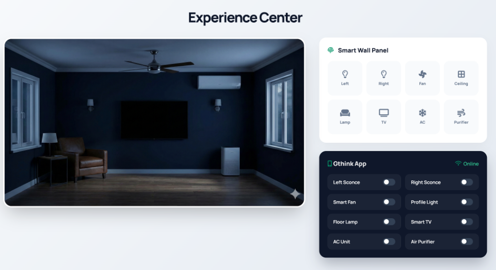

# Experience Center



An interactive **Smart Home Experience Center** demo built with refined UI/UX. This project demonstrates a control panel for various smart home devices, featuring real-time visual feedback and a responsive design.

## Features

- **Interactive Room Visualization**: Toggle devices to see immediate visual changes in the room (lighting, fans, appliances).
- **Smart Wall Panel**: A realistic touch panel interface for controlling devices.
- **Mobile App UI**: A simulation of a mobile smart home app with toggle switches.
- **Responsive Design**: Optimized for different screen sizes.
- **Modern UI**: Clean aesthetics with glassmorphism effects, smooth transitions, and a premium feel.

## Technologies Used

- **HTML5**: Semantic structure.
- **CSS3**: Advanced styling with variables, grid/flexbox, and animations.
- **JavaScript**: Logic for state management and DOM manipulation.

## How to Run

1. Clone the repository:
   ```bash
   git clone https://github.com/amkreddy555/GExperinceV1.git
   ```
2. Navigate to the project directory:
   ```bash
   cd GExperinceV1
   ```
3. Open `index.html` in your web browser.

## Live Demo

[View Live Demo](https://amkreddy555.github.io/GExperinceV1/)

## Author

**Gthink Inventors**
